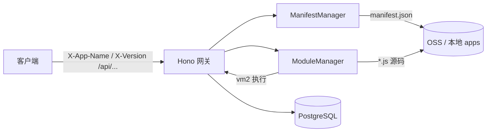

# Backend Gateway（Hono）技术方案

> 面向演讲：说明当前实现的定位、架构与关键设计，便于对外讲清楚「做什么、怎么做、边界在哪」。

---

## 1. 背景与目标

### 1.1 要解决什么问题

业务侧希望 **API 逻辑可按应用（app）与版本（version）独立发布**，网关统一接入 HTTP，而不把每个版本的代码都打进同一个 Node 进程镜像里做传统静态路由。典型诉求包括：

- **多租户隔离**：同一套网关进程服务多个 `appName + version`。
- **动态装载**：根据请求解析出目标路由，再 **拉取 manifest → 匹配路径 → 拉取对应 JS 处理器并执行**。
- **存储可插拔**：开发用本地目录，线上可走 **OSS（HTTP 拉取）**，路径约定一致。

### 1.2 当前实现的一句话概括

基于 **Hono + @hono/node-server** 的单一网关进程：所有 `/api/*` 请求通过请求头携带 **应用名与版本**，读取远端或本地的 **manifest.json** 做路由表匹配，再 **用 vm2 在沙箱中执行 CommonJS 形态的处理器代码**，并将返回值统一包装为 JSON；可选接入 **PostgreSQL（Drizzle ORM）** 供处理器使用。

---

## 2. 总体架构



**职责划分：**

| 组件 | 职责 |
|------|------|
| `index.ts` | 组装配置：根据环境选择 OSS 或本地 `ManifestFetcher` / `ModuleFetcher` |
| `app.ts` | Hono 应用：DB 中间件、错误处理、`/api/*` 统一入口、调用 manifest 与模块管理器 |
| `loader.ts` | `ManifestManager` / `ModuleManager`：拉取、TTL 缓存、vm2 装载 |
| `utils.ts` | 从请求头解析 app 信息、`pattern` 与路径匹配（含 `:param` 与 `*`） |

---

## 3. 请求路径与约定

### 3.1 URL 与请求头

- **路径**：统一前缀 `/api`，网关内部会把 `/api` 去掉后，与 manifest 里的 `pattern` 做匹配（例如内部用 `/hello`、`/users/123`）。
- **必选请求头**：
  - `X-App-Name`：应用标识（如 `myapp`）。
  - `X-Version`：版本（如 `latest` 或语义化版本号）。

实现见 `extractAppInfo`（`src/utils.ts`）。

### 3.2 存储路径约定（OSS 与本地一致）

以「应用名 + 版本」为根：

- **清单**：`{appName}/{version}/server/manifest.json`
- **处理器文件**：`{appName}/{version}/server/{file}`（`file` 来自 manifest 的 `file` 字段，如 `users/[id].js`）

本地开发默认根目录：`LOCAL_DEV_DIR`（默认 `process.cwd()/apps`），即 `apps/myapp/latest/server/...`。

### 3.3 manifest 结构

`manifest.json` 核心是 **`routes` 数组**，每项包含：

- `pattern`：与「去掉 `/api` 后的路径」匹配，支持 `:id` 动态段与 `*` 通配。
- `file`：该路由对应的 **服务端 JS 文件路径**（相对 `server/`）。
- `params`：元数据（当前路由匹配逻辑主要依据 `pattern` 解析参数）。

示例（节选）：

```json
{
  "routes": [
    { "pattern": "/hello", "file": "hello.js", "params": [] },
    { "pattern": "/users/:id", "file": "users/[id].js", "params": ["id"] }
  ]
}
```

---

## 4. 核心流程（一次请求的时序）

1. **解析租户**：从 Header 读取 `appName`、`version`，写入 Hono Context。
2. **规范化路径**：`requestPath = path.replace(/^\/api/, '') || '/'`。
3. **获取 manifest**：`ManifestManager.getManifest`（带 TTL 缓存，默认 5 分钟）。
4. **路由匹配**：`matchRoute(requestPath, routes)`，得到目标 `route` 与 `params`。
5. **加载模块**：`ModuleManager.getModule(appName, version, match.route.file)`（同样 TTL 缓存）。
6. **执行**：`c.set('params', match.params)`，调用 `module.default(c)`。
7. **响应**：若返回值为原生 `Response` 则原样返回；否则包装为 `{ success: true, data: result }`。

异常由 `app.onError` 统一转为 `{ success: false, error, message }`。

---

## 5. 动态代码执行（vm2）

### 5.1 为什么用 vm2

处理器以 **字符串形式** 从 OSS/本地读出，需要在运行时 **`run` 成可调用模块**。项目使用 **vm2 的 `NodeVM`**，以 CommonJS 包装执行，从而得到带 `default` 导出的对象。

### 5.2 当前沙箱配置要点（`loader.ts`）

- `wrapper: 'commonjs'`：与打包成 CJS 的处理器一致。
- `require.external`：显式允许 **`drizzle-orm`**，便于业务代码使用 ORM（与网关侧 DB 配合）。
- `require.builtin`：如 `path`、`crypto`。
- `console: 'inherit'`：便于排查业务日志。

### 5.3 与业务代码形态的关系

示例仓库中的 `users/[id].js` 等为 **打包后的 CommonJS**（含 `require("drizzle-orm/pg-core")` 等），与上述 `external` 策略一致。**若未来改为 ESM 纯源码**，需同步调整装载方式（vm2 对 ESM 支持有限，可能需换 `import()`、子进程或预编译策略）。

---

## 6. 缓存策略

| 对象 | 键 | 默认 TTL | 说明 |
|------|----|----------|------|
| Manifest | `appName:version` | 5 分钟 | 减少 manifest 请求 |
| 模块 | `appName:version:filePath` | 5 分钟 | 避免重复拉取与 vm 执行 |

`ManifestManager` / `ModuleManager` 均提供 `clearCache(...)`，便于运维或热更新场景扩展（例如管理 API 主动失效缓存）。

---

## 7. 数据库能力

- 网关进程通过 **`DATABASE_URL`** 创建 `pg` 连接池，使用 **Drizzle** 初始化 `db`。
- 通过中间件 **`c.set('db', db)`** 注入到所有路由（当前实现为全局注入；业务处理器通过 `c.get('db')` 使用）。
- 启动时会执行 `SELECT 1` 探测连接。

**注意**：DB 是 **网关共享** 的，多 app 共用同一连接与 schema 责任在业务侧（命名空间、schema、权限等需在应用代码与 DB 设计中区分）。

---

## 8. 配置与环境变量

| 变量 | 作用 |
|------|------|
| `OSS_BASE_URL` | 若设置：manifest 与模块均通过 `fetch` 从该基址拉取（生产向） |
| `LOCAL_DEV_DIR` | 未设置 OSS 时：本地目录根，默认 `./apps` |
| `DATABASE_URL` | PostgreSQL 连接串；不配置则 `db` 为空，业务可返回「未配置」类信息 |

端口当前在 `AppConfig` 中默认为 **3001**（见 `index.ts`）。

---

## 9. 安全与运维边界（演讲时可坦诚说明）

**优势：**

- 请求级租户通过 Header 区分，与 manifest 版本绑定，便于 **按版本灰度**。
- vm2 相对 `eval` 提供 **一定隔离**；对外部 npm 通过 `require.external` **白名单** 收敛。

**风险与改进方向（建议口头带出）：**

- **vm2 维护状态**：社区对 vm2 长期维护性有讨论，生产需评估升级路径（如 isolated-vm、独立 worker、WASM 等）。
- **Header 信任**：`X-App-Name` / `X-Version` 若可被任意客户端伪造，需在网关前增加 **鉴权、签名校验或仅内网可达**。
- **资源与 DoS**：动态执行 + 无超时封装时，恶意或劣质代码可能拖垮进程；可补充 **超时、并发限制、按 app 熔断**。
- **共享 DB**：敏感场景应对 **连接串、schema、行级权限** 做隔离设计。

---

## 10. 构建与运行

- **构建**：`tsup` 打包 `src/index.ts`，输出 `dist/`，Node 目标为 **22**（见 `tsup.config.ts`）。
- **运行**：`pnpm build && pnpm start` → `node dist/index.js`。

依赖要点：**Hono**（经 `@hono/node-server` 引入）、**vm2**、**drizzle-orm**、**pg**。

---

## 11. 演进建议（可选幻灯片收尾）

1. **鉴权与租户可信**：JWT / mTLS / 内部网关统一注入 Header。
2. **缓存失效**：发布流水线回调网关，精确 `clearCache(app, version)`。
3. **可观测性**：结构化日志、按 `appName/version/route` 打点、tracing。
4. **执行模型升级**：评估替换 vm2、或 **边车进程** 执行用户代码，与网关解耦。
5. **manifest 校验**：JSON Schema 校验、CI 中校验路由无冲突。

---

## 12. 小结（30 秒版）

本项目实现了一个 **基于 Hono 的 API 网关**：通过 **`X-App-Name` + `X-Version`** 定位租户与版本，用 **manifest 描述路由到文件的映射**，从 **OSS 或本地** 拉取 **JS 处理器**，在 **vm2** 中执行并统一 JSON 响应，并可选注入 **共享 PostgreSQL**。适合 **多应用、多版本、远端分发业务逻辑** 的场景；上线前需补齐 **安全、隔离与可观测性** 方面的工程化措施。

---

*文档版本：与仓库当前 `src/` 实现同步整理，用于技术分享与评审。*
