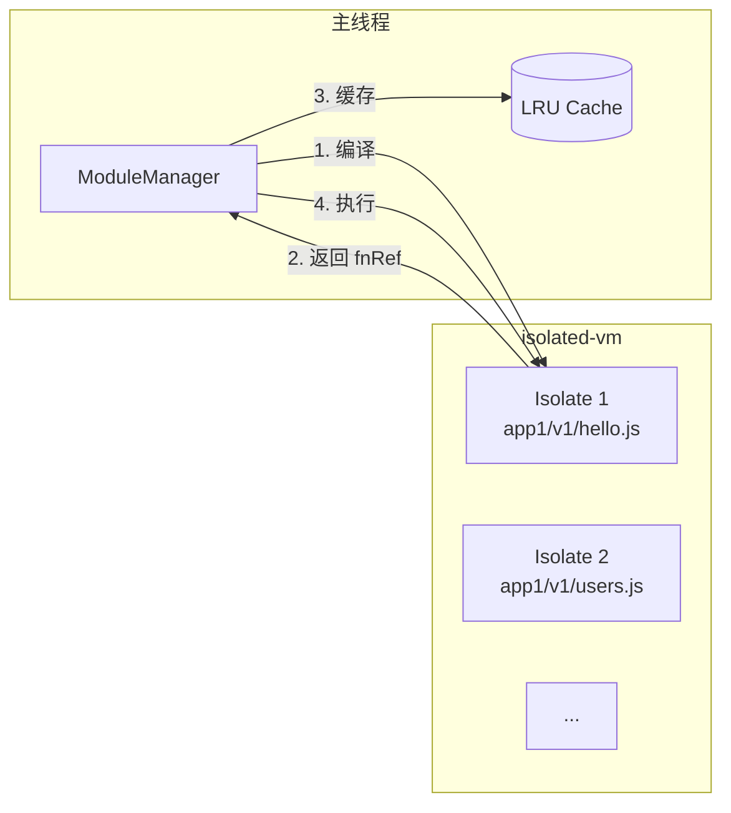

# isolated-vm 改造方案

> 将动态代码执行引擎从 `vm2` 迁移至 `isolated-vm`，解决 `while(true)` 死循环、内存泄漏等安全问题，同时保持模块缓存能力。

---

## 1. 背景与问题

### 1.1 当前实现的问题

当前使用 `vm2` 的 `NodeVM` 执行动态模块代码：

```ts
const vm = new NodeVM({ /* 沙箱配置 */ });
const module: RouteModule = vm.run(code, filename);
// 后续缓存 module，调用 module.default(c)
```

**存在的问题：**

| 问题 | 影响 |
|------|------|
| `vm2` 已废弃 | 作者宣布不再维护，存在已知安全漏洞无法修复 |
| 同步 `while(true)` 死循环 | 卡死事件循环，整个网关假死 |
| 无内存限制 | 动态代码可无限制分配内存，导致进程 OOM |
| 无执行超时 | 代码可以无限执行，无法中断 |

### 1.2 为什么不用 `worker_threads`

`worker_threads` 的 `postMessage` 使用结构化克隆（structured clone）进行通信，**函数、对象引用等无法跨线程传递**。这意味着：

- 编译好的 `RouteModule`（包含 `default` 函数）无法从 worker 返回给主线程做 LRU 缓存
- Hono 的 `Context` 对象（`c`）也无法序列化传递给 worker

因此 `worker_threads` 不适合需要缓存模块引用的场景。

---

## 2. isolated-vm 简介

[`isolated-vm`](https://github.com/laverdet/isolated-vm) 是一个 Node.js 原生插件，提供真正的 V8 隔离沙箱：

- **独立的 V8 隔离区（Isolate）**：拥有独立的堆、GC、执行上下文
- **CPU 超时**：`timeout` 参数可以中断同步死循环（包括 `while(true)`）
- **内存限制**：`memoryLimit` 参数限制堆大小
- **引用传递**：通过 `Reference` 对象可以在主线程和隔离区之间传递函数引用

### 与 vm2 的核心区别

| 特性 | vm2 | isolated-vm |
|------|-----|-------------|
| 隔离级别 | 同一 Isolate，通过 JS 代理模拟沙箱 | 独立 Isolate，真正的 V8 隔离 |
| `while(true)` 防护 | ❌ 不能 | ✅ `timeout` 参数可中断 |
| 内存限制 | ❌ 不支持 | ✅ `memoryLimit` 参数 |
| 维护状态 | ❌ 已废弃 | ✅ 活跃维护 |
| 编译/执行分离 | ❌ 不支持 | ✅ `compileScript` + `run` 分离 |
| 函数引用传递 | ✅ 原生支持 | ✅ 通过 `Reference` 支持 |

---

## 3. 改造方案

### 3.1 整体架构



**关键设计**：每个模块文件对应一个独立的 `Isolate` 实例，编译后的函数引用（`Reference`）可以缓存到 LRU 中，下次直接调用。

### 3.2 核心 API 使用示例

```ts
import ivm from 'isolated-vm';

// 1. 创建隔离区（每个模块一个）
const isolate = new ivm.Isolate({ memoryLimit: 32 }); // 32MB 内存限制

// 2. 创建执行上下文
const context = await isolate.createContext();

// 3. 编译脚本（可缓存编译结果）
const script = await isolate.compileScript(`
  // CommonJS 包装的模块代码
  module.exports = {
    default: (c) => {
      return { hello: 'world' };
    }
  };
`);

// 4. 执行脚本，注入到上下文
await script.run(context);

// 5. 获取模块导出
const moduleExports = await context.eval('module.exports');
const fnRef = await moduleExports.get('default'); // 返回 Reference

// 6. 执行函数（带超时）
const result = await fnRef.apply(undefined, [c], { timeout: 5000 });

// 7. fnRef 可以缓存，下次直接调用
// 不需要重新编译
```

### 3.3 改造后的 ModuleManager

```ts
import ivm from 'isolated-vm';

interface CachedModule {
  isolate: ivm.Isolate;
  context: ivm.Context;
  fnRef: ivm.Reference;  // 指向 default 函数的引用
}

export class ModuleManager {
  private lruCache = new LRUCache<string, CachedModule>({
    max: 1000,
  });

  async getModule(
    appName: string,
    version: string,
    filePath: string
  ): Promise<CachedModule> {
    const cacheKey = `${appName}:${version}:${filePath}`;
    const cached = this.lruCache.get(cacheKey);
    if (cached) return cached;

    const code = await this.fetchModule(appName, version, filePath);

    // 创建隔离区
    const isolate = new ivm.Isolate({ memoryLimit: 32 });
    const context = await isolate.createContext();

    // 注入全局对象（如 console、require 等）
    // 注入 db、params 等网关上下文
    const global = await context.global;
    // ... 设置全局变量

    // 编译并执行
    const script = await isolate.compileScript(code);
    await script.run(context);

    // 获取 default 函数引用
    const moduleExports = await context.eval('module.exports');
    const fnRef = await moduleExports.get('default');

    const cachedModule: CachedModule = { isolate, context, fnRef };
    this.lruCache.set(cacheKey, cachedModule);
    return cachedModule;
  }

  async executeModule(
    appName: string,
    version: string,
    filePath: string,
    context: any,  // Hono 的 c 对象
    timeout: number = 5000
  ): Promise<any> {
    const mod = await this.getModule(appName, version, filePath);

    // 执行函数，带超时
    // timeout 参数可以中断 while(true) 等同步死循环
    const result = await mod.fnRef.apply(undefined, [context], {
      timeout,
    });

    return result;
  }
}
```

### 3.4 请求处理流程（app.ts 改动）

```ts
// app.ts 中的路由处理
app.all("/api/*", async (c) => {
  // ... 解析 appName、version、匹配路由 ...

  // 执行模块（带 5 秒超时）
  const result = await moduleManager.executeModule(
    appName,
    version,
    match.route.file,
    c,        // 传递 Hono Context
    5000      // 超时时间
  );

  return toResponse(c, result);
});
```

### 3.5 错误处理

```ts
try {
  const result = await mod.fnRef.apply(undefined, [context], {
    timeout: 5000,
  });
} catch (err) {
  if (err instanceof ivm.TimeoutError) {
    // 超时：代码执行超过 5 秒（可能是 while(true) 死循环）
    console.error(`Module execution timeout: ${filePath}`);
    // 注意：超时后 Isolate 可能处于不一致状态
    // 建议从缓存中移除，下次重新创建
    this.lruCache.delete(cacheKey);
    mod.isolate.dispose();
    throw new Error(`Module execution timeout: ${filePath}`);
  }
  // 其他执行错误
  throw err;
}
```

---

## 4. 关键设计决策

### 4.1 每个模块一个 Isolate

- **原因**：不同模块可能来自不同应用/版本，需要完全隔离
- **代价**：每个 Isolate 约 4-8MB 内存开销，1000 个模块约 4-8GB
- **优化**：可考虑同一应用的多个模块共享一个 Isolate

### 4.2 超时后的处理

- `isolated-vm` 的超时是通过向 V8 隔离区发送中断信号实现的
- 超时后，Isolate 可能处于不一致状态（执行到一半被中断）
- **建议**：超时后从缓存中移除该模块，下次请求重新创建 Isolate

### 4.3 全局对象注入

需要向沙箱中注入网关上下文（如 `c` 对象）：

```ts
const global = await context.global;
await global.set('console', new ivm.Reference(console));
await global.set('setTimeout', new ivm.Reference(setTimeout));
// 注意：Hono 的 c 对象不能直接传递，需要通过 Reference 包装
```

**重要**：Hono 的 `c`（Context）对象包含很多方法，直接传递可能有问题。需要评估是否需要将 `c` 的方法提取为纯数据再传递，或者通过 `Reference` 包装后传递。

---

## 5. 迁移步骤

### 5.1 安装依赖

```bash
pnpm add isolated-vm
# isolated-vm 是原生模块，需要系统有 C++ 编译环境
# macOS: xcode-select --install
# Ubuntu: apt install build-essential python3
```

### 5.2 代码改动清单

| 文件 | 改动内容 |
|------|---------|
| `src/loader.ts` | 替换 `NodeVM` 为 `isolated-vm`，修改 `ModuleManager` 实现 |
| `src/types.ts` | 新增 `CachedModule` 类型 |
| `src/app.ts` | 修改 `module.default(c)` 调用为 `moduleManager.executeModule(...)` |
| `package.json` | 移除 `vm2` 依赖，添加 `isolated-vm` 依赖 |

### 5.3 测试要点

1. **正常功能测试**：确保现有路由处理器能正常执行
2. **超时测试**：构造 `while(true)` 代码，验证 5 秒后超时抛出异常
3. **内存限制测试**：构造内存泄漏代码，验证 OOM 被捕获
4. **缓存测试**：验证 LRU 缓存正常工作，多次请求不重复编译
5. **并发测试**：验证多个模块同时执行不互相影响

---

## 6. 注意事项

### 6.1 原生模块编译

`isolated-vm` 是 C++ 原生模块，安装时需要编译：

- **macOS**：需要 Xcode Command Line Tools
- **Linux**：需要 `build-essential`、`python3`
- **Docker**：Dockerfile 中需要安装编译工具链

### 6.2 性能考量

| 操作 | 耗时估算 | 说明 |
|------|---------|------|
| 创建 Isolate | ~10-50ms | 仅在首次加载模块时 |
| 编译脚本 | ~5-20ms | 仅在首次加载模块时 |
| 执行函数 | ~0.1-5ms | 每次请求，取决于业务逻辑 |
| 超时中断 | ~0.1ms | 超时后中断执行 |

**缓存命中后**，每次请求仅需执行函数，性能开销很小。

### 6.3 与现有代码的兼容性

- 现有模块代码（CommonJS 格式）无需修改
- `module.default(c)` 的签名保持不变
- 返回值的处理逻辑不变

---

## 7. 回退方案

如果 `isolated-vm` 在生产环境遇到问题（如原生模块兼容性），可以：

1. **回退到 vm2**：保留当前实现作为 fallback
2. **使用 `worker_threads` + 每次重新编译**：牺牲性能换取安全
3. **使用子进程**：通过 `child_process.fork()` 执行，但通信成本更高

建议在代码中预留一个配置开关：

```ts
const engine = process.env.MODULE_ENGINE || 'isolated-vm';
// 'vm2' | 'isolated-vm' | 'worker'
```

---

## 8. 参考资源

- [isolated-vm GitHub](https://github.com/laverdet/isolated-vm)
- [isolated-vm 文档](https://github.com/laverdet/isolated-vm/blob/main/README.md)
- [vm2 废弃公告](https://github.com/patriksimek/vm2/issues/533)
